## Tugas 10 Pemrograman Jaringan

## Soal
1. Pull update terbaru
2. Jalankan async_server.py pada port 9002, 9003, 9004, 9005 (lihat pada BackendList)
3. Jalankan file lb.py, jalankan di port 44444
4. Jalankan browser, akseslah http://localhost:44444/page.html
5. Lihatlah di log program, bahwa setiap request akan dilayani oleh backend yang bergantian
6. Lakukan performance test seperti pada tugas 9, bandingkan penggunaan load balancer dengan async_server dengan server_thread_http pada folder progjar5
7. Buatlah tabel hasilnya

Jalankan Server
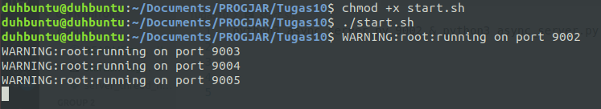  

Jalankan lb.py
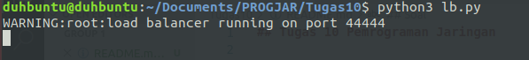  

Jalankan browser, akseslah http://localhost:44444/page.html
  

Log server, request dihandle server berbeda
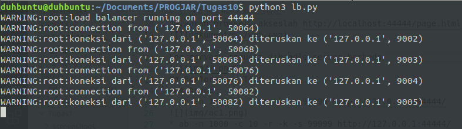    

## Performance Test
### Load Balanced
* ab -n 1000 -c 1 -r -k -s 99999 http://127.0.0.1:44444/
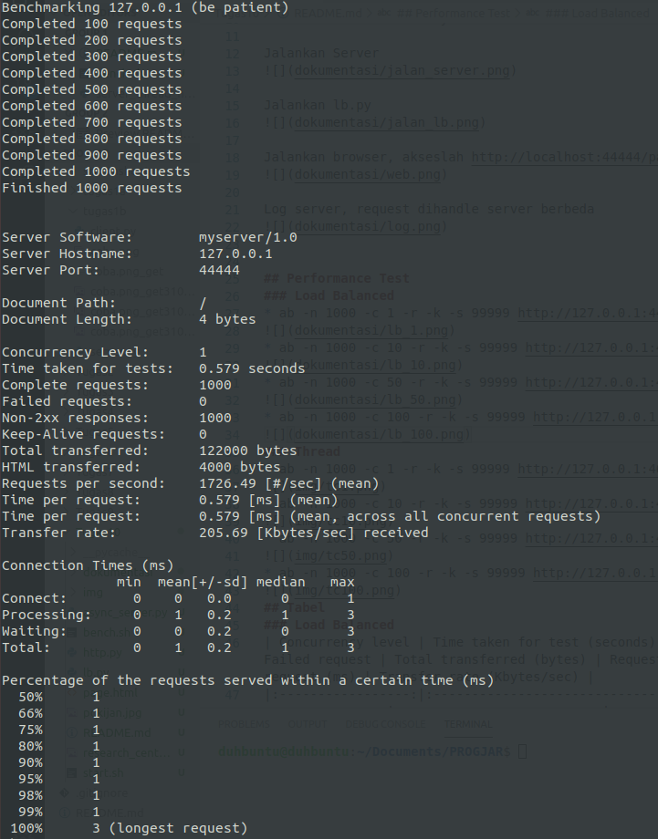  
* ab -n 1000 -c 10 -r -k -s 99999 http://127.0.0.1:44444/
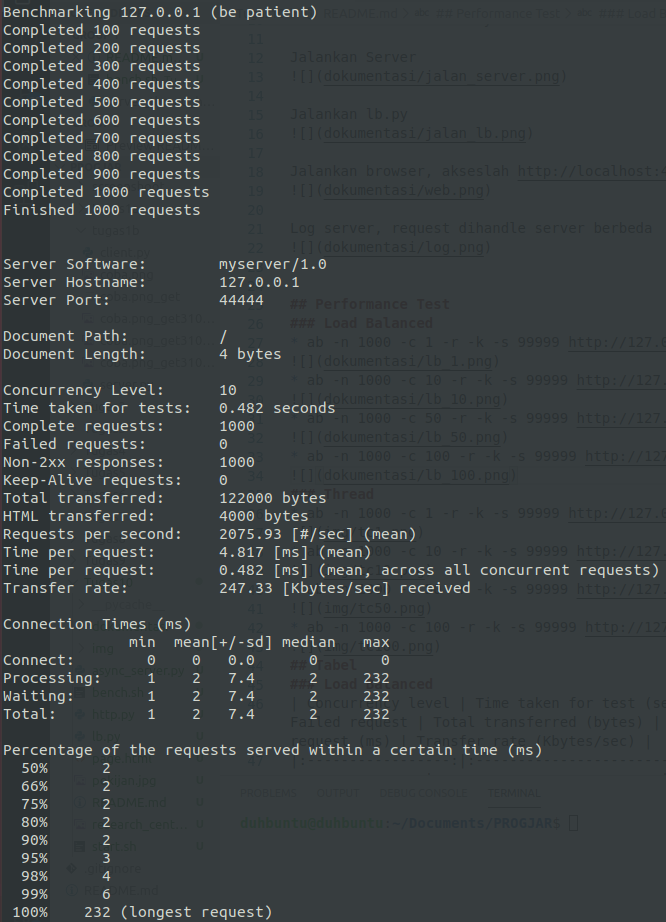  
* ab -n 1000 -c 50 -r -k -s 99999 http://127.0.0.1:44444/
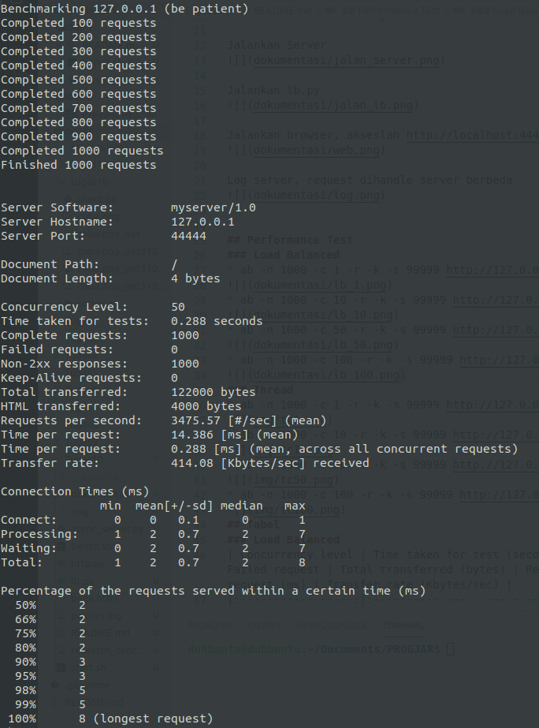  
* ab -n 1000 -c 100 -r -k -s 99999 http://127.0.0.1:44444/
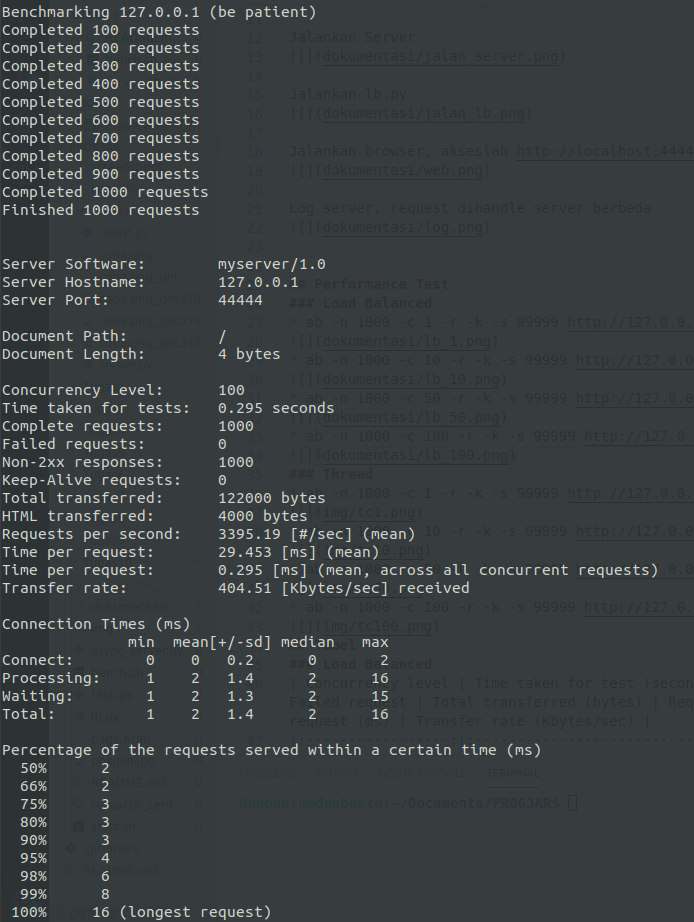  
### Thread
* ab -n 1000 -c 1 -r -k -s 99999 http://127.0.0.1:46000/
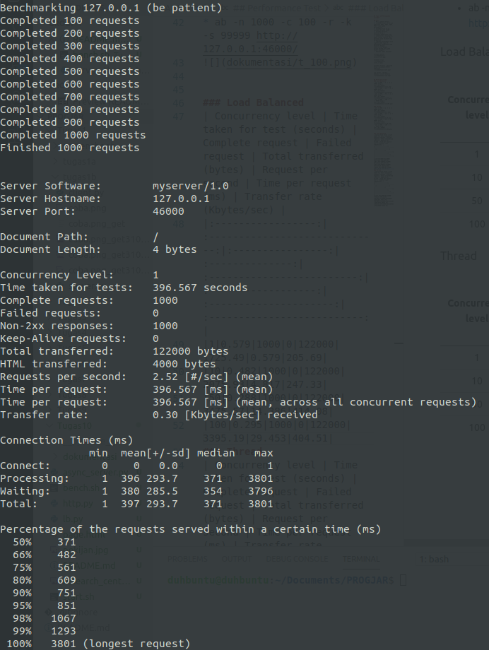  
* ab -n 1000 -c 10 -r -k -s 99999 http://127.0.0.1:46000/
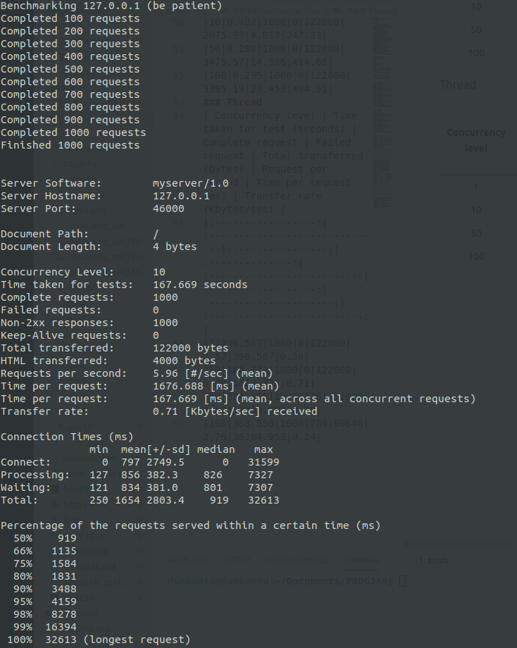  
* ab -n 1000 -c 50 -r -k -s 99999 http://127.0.0.1:46000/
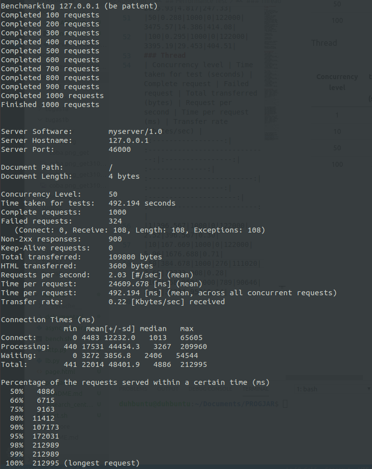  
* ab -n 1000 -c 100 -r -k -s 99999 http://127.0.0.1:46000/
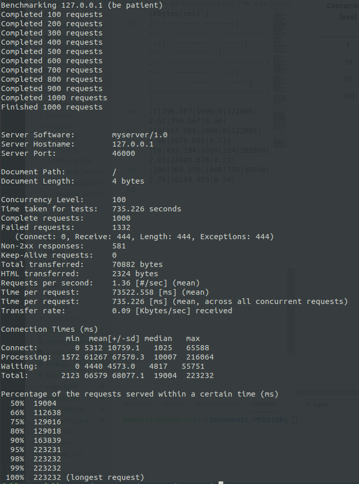

### Load Balanced
| Concurrency level | Time taken for test (seconds) | Complete request | Failed request | Total transferred (bytes) | Request per second | Time per request (ms) | Transfer rate (Kbytes/sec) |
|:-----------------:|:-----------------------------:|:----------------:|:--------------:|:-------------------------:|:------------------:|:---------------------:|:--------------------------:|
|1|0.579|1000|0|122000|1725.49|0.579|205.69|
|10|0.482|1000|0|122000|2075.93|4.817|247.33|
|50|0.288|1000|0|122000|3475.57|14.386|414.08|
|100|0.295|1000|0|122000|3395.19|29.453|404.51|
### Thread
| Concurrency level | Time taken for test (seconds) | Complete request | Failed request | Total transferred (bytes) | Request per second | Time per request (ms) | Transfer rate (Kbytes/sec) |
|:-----------------:|:-----------------------------:|:----------------:|:--------------:|:-------------------------:|:------------------:|:---------------------:|:--------------------------:|
|1|396.567|1000|0|122000|2.52|396.567|0.30|
|10|167.669|1000|0|122000|5.96|1676.688|0.71|
|50|492.194|1000|324|109800|2.03|24609.678|0.22|
|100|735.226|1000|1332|70882|1.36|73522.558|0.09|
