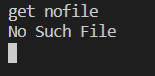

## Dokumentasi Tugas 4

### PROTOCOL FORMAT

client.py menerima command sebagai inputnya dengan format

**COMMAND** **PARAMETER**

dimana **COMMAND** diikuti oleh sebuah **PARAMETER** berupa *nama file* yang dipisahkan oleh spasi

### FITUR

- PUT : Untuk mengupload file ke server  
command : put    
parameter : nama file     
response :
    - File berhasil dikirim : File Sent
    - File tidak ada pada user : file not found

- LIST : Untuk melihat daftar file pada server  
command : list    
parameter : -   
response : JSON dari isi server

- GET : Untuk mendownload file dari server  
command : get    
parameter : nama file     
response :
    - File berhasil didownload : Downloaded
    - File tidak ada pada server : No Such File

- jika command tidak dikenali akan merespon dengan ERRCMD

### CARA MELAKUKAN REQUEST

Pastikan server sudah menyala terlebih dahulu, lalu jalankan client.py.  
client.py akan menerima command dan parameter sebagai input yang akan di kirim ke server    

#### PUT

Response yang didapat adalah File Sent, dan server akan membuat file pada server tersebut

#### LIST

#### GET

Response yang didapat adalah File Downloaded, dan client akan menerima file dari server tersebut

