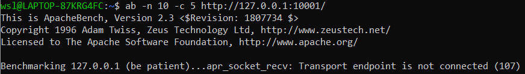
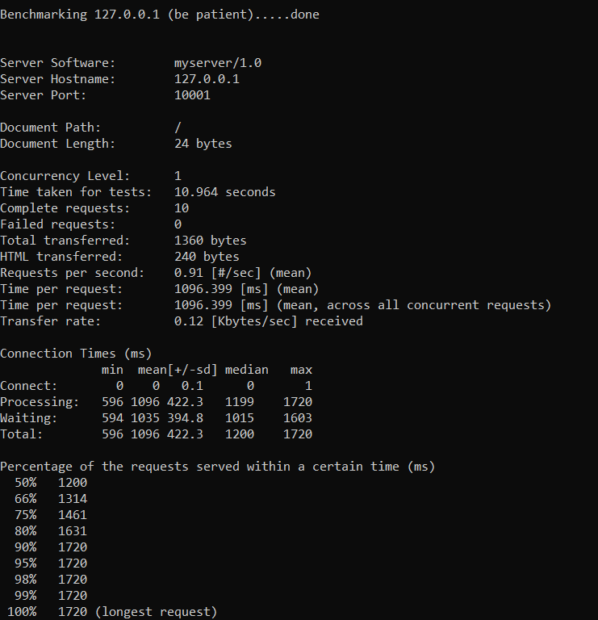
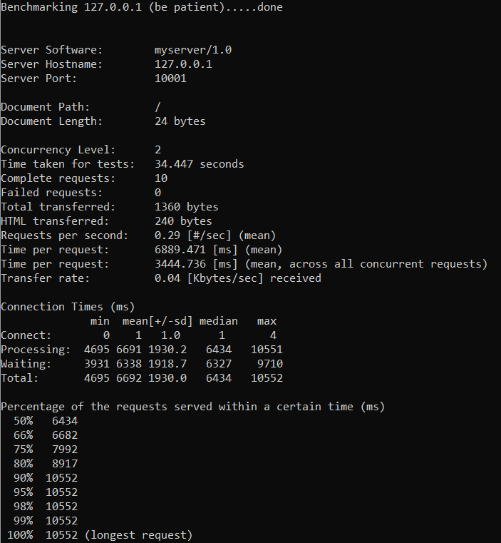
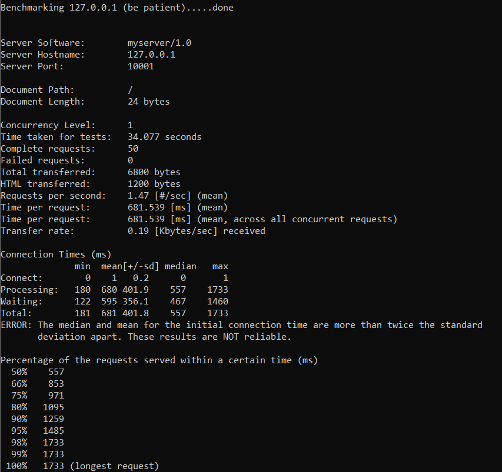
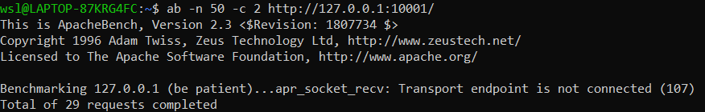
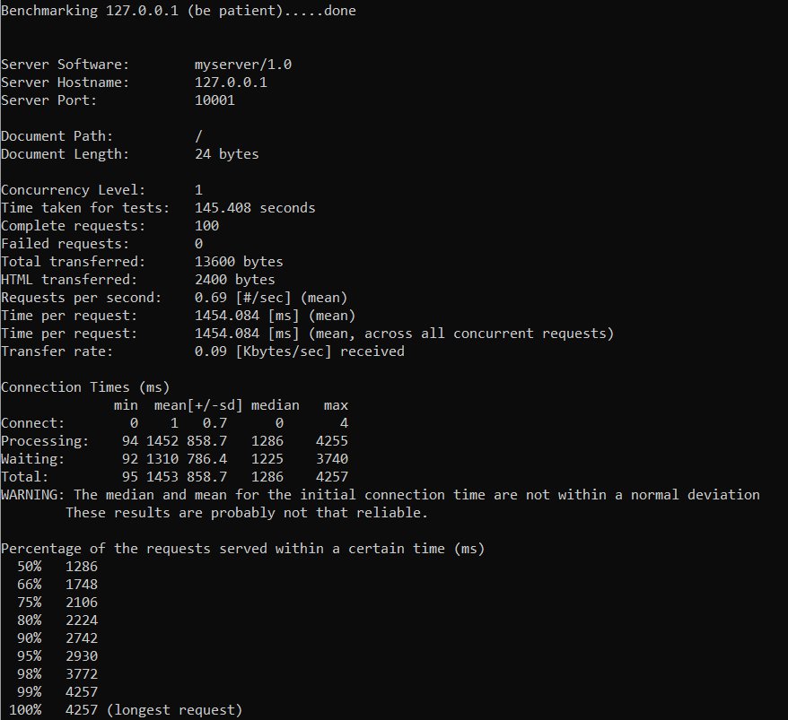

## Tugas 7 Pemrograman Jaringan

## Summary
| No test | Concurrency level | Time taken for test (seconds) | Complete request | Failed request | Total transferred (bytes) | Request per second | Time per request (ms) | Transfer rate (Kbytes/sec) |
|:-------:|:-----------------:|:-----------------------------:|:----------------:|:--------------:|:-------------------------:|:------------------:|:---------------------:|:--------------------------:|
|1|1|1.500|10|0|1360|6.67|149.969|0.89|
||2|34.447|10|0|1360|0.29|6889.471|0.04|
|2|1|34.077|50|0|6800|1.47|681.539|0.19|
||2|?|29|21|?|?|?|?|
|3|1|145.408|100|0|13600|0.69|1454.084|0.09|
||2|74.327|100|0|13600|1.35|1486.084|0.18|

Karena server saya coba pada arsitektur amd, server saya tidak bisa merespon pada multi-thread benchmark dengan concurency lebih dari 2.    
### Catatan :   
Saya tidak merubah server menjadi lebih lambat, saya malah merubah server selalu merespon kode 200 kepada semua request

Berikut buktinya:   

## 10 Request
### 1 Concurrency

### 2 Concurrency

## 50 Request
### 1 Concurrency

### 2 Concurrency

## 100 Request
### 1 Concurrency

### 2 Concurrency
