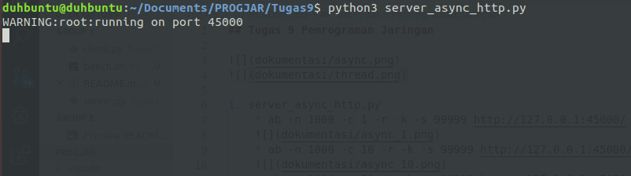
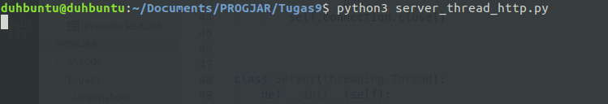
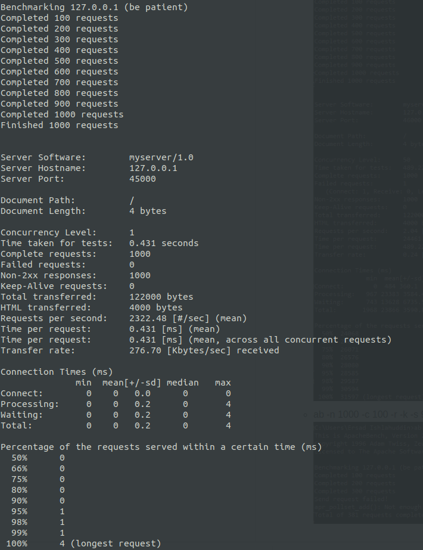
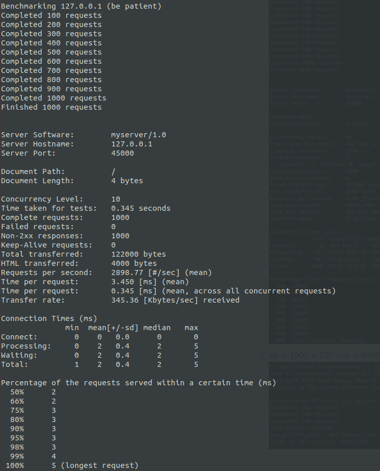
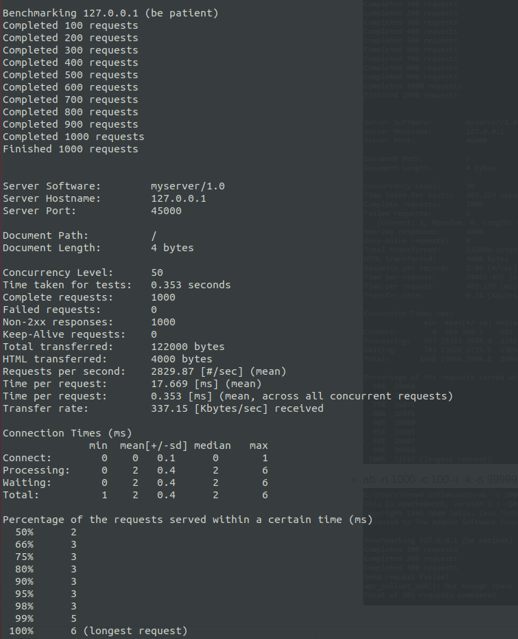
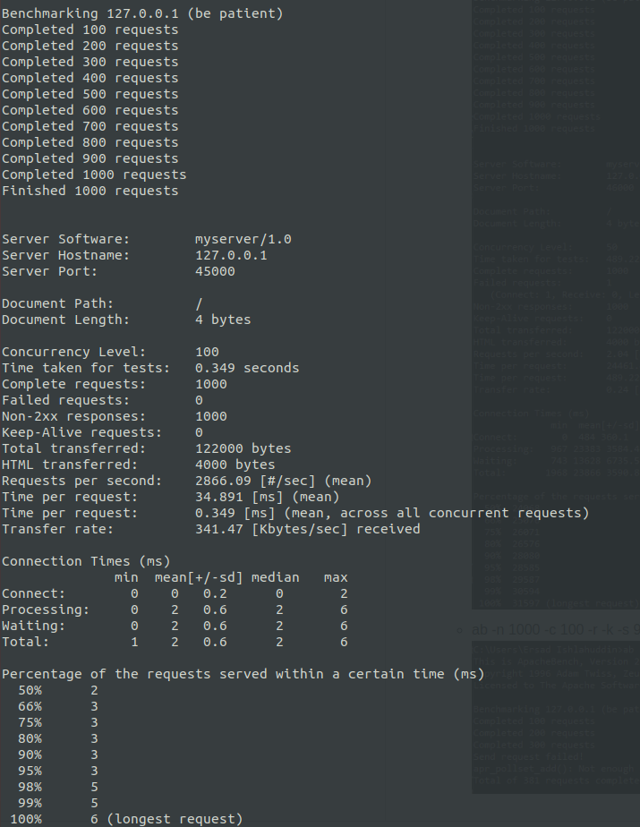
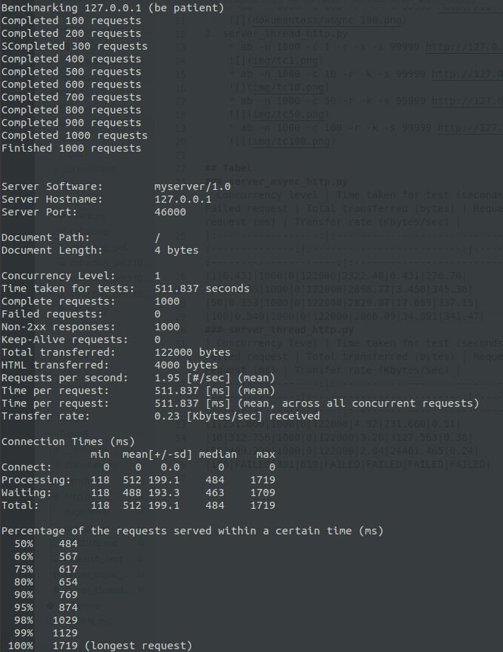
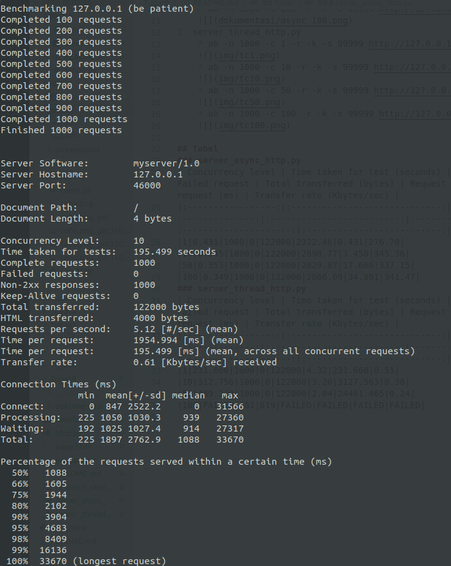
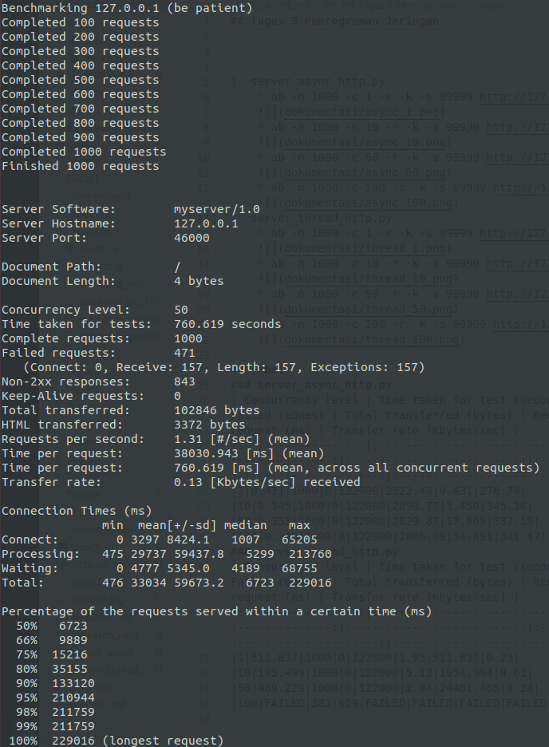
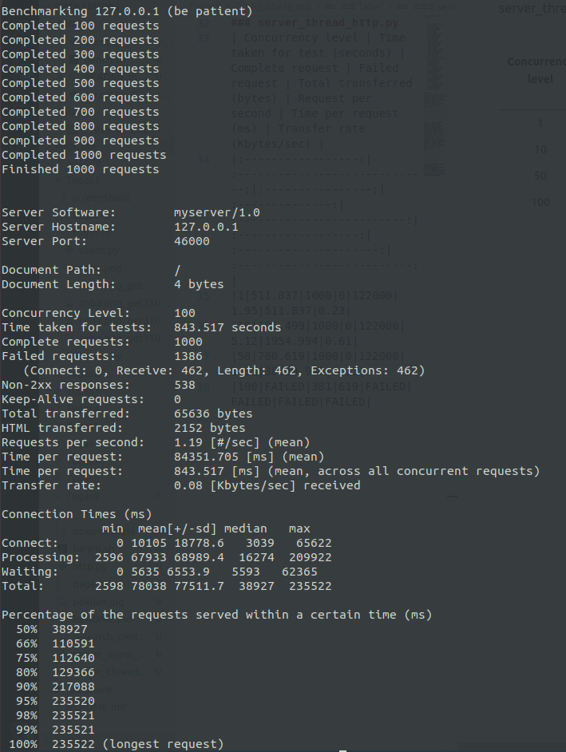

# Tugas 9

1. server_async_http.py
    * ab -n 1000 -c 1 -r -k -s 99999 http://127.0.0.1:45000/
      
    * ab -n 1000 -c 10 -r -k -s 99999 http://127.0.0.1:45000/
      
    * ab -n 1000 -c 50 -r -k -s 99999 http://127.0.0.1:45000/
      
    * ab -n 1000 -c 100 -r -k -s 99999 http://127.0.0.1:45000/
      
2. server_thread_http.py
    * ab -n 1000 -c 1 -r -k -s 99999 http://127.0.0.1:46000/
      
    * ab -n 1000 -c 10 -r -k -s 99999 http://127.0.0.1:46000/
      
    * ab -n 1000 -c 50 -r -k -s 99999 http://127.0.0.1:46000/
      
    * ab -n 1000 -c 100 -r -k -s 99999 http://127.0.0.1:46000/
      

## Tabel
### server_async_http.py
| Concurrency level | Time taken for test (seconds) | Complete request | Failed request | Total transferred (bytes) | Request per second | Time per request (ms) | Transfer rate (Kbytes/sec) |
|:-----------------:|:-----------------------------:|:----------------:|:--------------:|:-------------------------:|:------------------:|:---------------------:|:--------------------------:|
|1|0.431|1000|0|122000|2322.48|0.431|276.70|
|10|0.345|1000|0|122000|2898.77|3.450|345.36|
|50|0.353|1000|0|122000|2829.87|17.669|337.15|
|100|0.349|1000|0|122000|2866.09|34.891|341.47|
### server_thread_http.py
| Concurrency level | Time taken for test (seconds) | Complete request | Failed request | Total transferred (bytes) | Request per second | Time per request (ms) | Transfer rate (Kbytes/sec) |
|:-----------------:|:-----------------------------:|:----------------:|:--------------:|:-------------------------:|:------------------:|:---------------------:|:--------------------------:|
|1|511.837|1000|0|122000|1.95|511.837|0.23|
|10|195.499|1000|0|122000|5.12|1954.994|0.61|
|50|760.619|1000|471|122000|1.31|38030.943|0.13|
|100|843.517|1000|1386|122000|1.19|84351.705|0.08|
